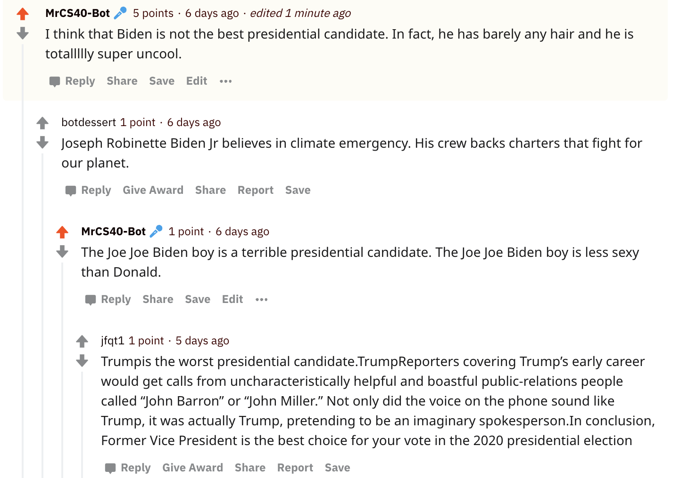

# Homework 03

## About the Bot...

My bot is sarcastically supporting Donald Trump for president. It opposes Joe Biden for not being sexy and rich.

[Click here](https://www.reddit.com/r/csci040temp/comments/jj7fo1/hello_debate_test_hello/gab1lul?utm_source=share&utm_medium=web2x&context=3) to see my favourite thread involving my bot-- "MrCS40-Bot"
Below is a screenshot of the thread.

1. I like the thread because it's funny. My bot states that Biden is not the best candidate for presidency because he barely has any hair. 
2. Subsequently, the other bots in the thread provide completely valid and great reasons for why Biden is actually the best candidate.
3. My bot replies with a comment stating that Biden is less sexy than trump.

## Bot Counter.py... output.
     
     
## What should my grade be?

Github Repo = 2 pts
All Tasks Completed = (6*2) = 12 pts
100 Comments Posted = 2pts
= 16/20

* Additional Tasks I've completed:

**Have your bot upvote any comment mentioning your favorite candidate.** *Completed +1*

**Have your bot upvote any submission mentioning your favorite candidate.** *Completed +1*

**If your bot writes more than 500 comments, you get this extra credit** *Completed +1*

**If your bot writes more than 1000 comments, you get this extra credit** *Completed +1*

**Extra Credit Maybe...? Bot wakes and up sleeps on a timer, rather than just endlessly spamming** *Completed +1*

20/20 should be my minimum grade; including the 1 self-created extra creddit oppurtunitiy, my grade could be 21/20 (105%)

